# Tamagotchi Transcendence — v2


**🌐 [Live Demo](https://transcendence-3-d-v2.vercel.app/)**

A Tamagotchi-inspired evolution sim where your digital pet moves through the spectrum of light and emotion… and ultimately transcends.

**This is a major upgrade of my earlier project [transcendence-pet-sim](https://github.com/Cordero080/transcendence-pet-sim).** New UI, my own character designs, a device-style **power button**, a real **training** system, incremental **size growth** as the pet evolves, a **DNA sinewave** backdrop, a full **Blender → FBX → Three.js** animation pipeline, and a full **audio** pass (SFX + theme music switch).

## 🥚 Easter Egg: The Upside

Look closely at the bottom-left corner of the screen. There's a barely-visible button that says **"upside!"** — it's meant to blend into the background as a secret for curious players.

Click it to enter the **Battle Arena** — a hidden React Three Fiber experience with 3 unique scenes:

### Scene 1: Dance Battle

- Panoramic neopunk backdrop
- Pulsing cerulean ring grid
- Two metallic chrome cats facing off
- Colorful spotlights (pink, red, blue, purple)
- WASD/Arrow controls to move characters

### Scene 2: Fighting Arena

- Neon neopunk cityscape
- Arena platform with glowing edges
- Battle-ready environment

### Scene 3: Training Dojo

- Japanese-inspired aesthetic
- Animated cherry blossom petals (2D canvas overlay)
- Bamboo poles with flickering paper lanterns
- Glowing gradient ring with GLSL shader animation
- Three cats training on the mat
- Toggle between auto-animate and manual control modes

## 🚀 Getting Started

### Prerequisites

- Node.js (v14 or higher)
- Modern browser with WebGL support (Chrome, Firefox, Safari, Edge)

### Installation & Running

1. **Clone the repository**

   ```bash
   git clone https://github.com/Cordero080/Transcendence-3D-v2.git
   cd Transcendence-3D-v2
   ```

2. **Install dependencies**

   ```bash
   npm install
   ```

3. **Start the development server**

   ```bash
   npm run dev
   ```

4. **Open your browser** to the local URL shown in the terminal (usually `http://localhost:5173`)

5. **Click the Power button** to boot up the simulation and start playing!

### Other Commands

```bash
npm run build    # Build for production
npm run preview  # Preview production build
npm test         # Run unit tests
npm run test:watch  # Run tests in watch mode
```

## ✨ What's New

- **Power button** (boot/shutdown the sim).
- **Training** added as a core care action; required for evolution and for sustaining the final stage.
- **Incremental growth**: the creature scales up a bit each evolution (not just a color swap).
- **DNA sinewave** animated background.
- **3D pipeline**: modeled/rigged/animated in **Blender**, imported via **Three.js** FBX loader. **32 animations** total (idles, feed, dance, sleep, train, reacts, fail/success, etc.).
- **Audio polish**: training grunts & impacts; **music switches** during Dance.
- **Final stage rule**: in Translucent White, **Training is the only required care**; idle uses a **Qi-Gong/meditative** loop.
- **UI overhaul** for clarity and device feel.

## 🎮 Game Summary

You hatch a glitched egg. An intergalactic pet emerges and evolves by **color**, **mood**, and **size**. Keep it alive by **Feeding**, **Dancing**, **Sleeping**, and **Training**. Neglect it and it fades from the simulation; guide it well and it reaches a translucent, nearly-not-there state (transcendence).

## 🕹️ Controls & Care Actions

- **Power** — boot/shutdown.
- **Feed** — restore hunger.
- **Dance** — raise fun; switches to dance theme.
- **Sleep** — restore rest.
- **Train** — build discipline/power; SFX + grunts. _Required for evolution and for the White stage._

## 🌈 Evolution Order (current path)

1. 🐣 **Hatch / Blue** — first form
2. 🟡 **Yellow** — power / confidence
3. 🟢 **Green** — growth / energy
4. 🔴 **Red** — peak / fury
5. ⚪ **Translucent White** — transcendence (training-only care; qi-gong idle)

Each step tints the pet **and** scales it up slightly.

## 📈 Win / Lose

- **Win**: Reach **Translucent White** and maintain equilibrium (training only).
- **Lose**: Any stat bottoms out → pet fades from reality.

## 🔁 Core Loop (pseudocode)

POWER ON → boot sequence → glitch egg → hatch

while (powered && alive):
show stats (hunger, rest, fun, discipline)
wait for action:
Feed → hunger++
Dance → fun++ (switch to dance theme)
Sleep → rest++
Train → discipline++ (SFX/grunts)
if cycle complete (Feed + Dance + Sleep + Train) and thresholds met:
evolve() // color shift + size up + animation set
if stage === TranslucentWhite:
requiredCare = Train only (idle = qi-gong)
degrade stats over time
if any stat <= 0: fadeOut(); alive = false

POWER OFF → save state → shutdown animation

## 🧩 Technologies Used

- **Three.js** — 3D rendering, scene management, FBX animation blending
- **JavaScript ES6+** — Core game logic and state management
- **Blender 3D** — Character modeling, rigging, and animation authoring (32 animations)
- **Web Audio API** — SFX and dynamic music switching
- **Jest** — Unit testing for game modules
- **HTML5/CSS3** — Vanilla JS UI, device frame, DNA sinewave background

## 📷 Screenshots

### Power On / Intro Screen

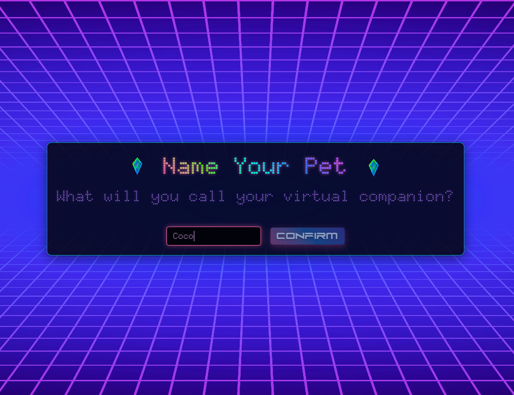

### Glitch Egg / Hatch Sequence

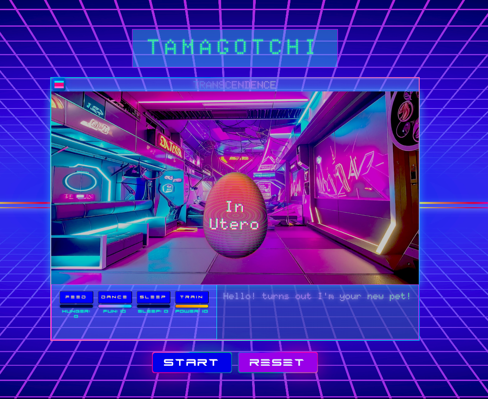

### Blue Form (First Evolution)

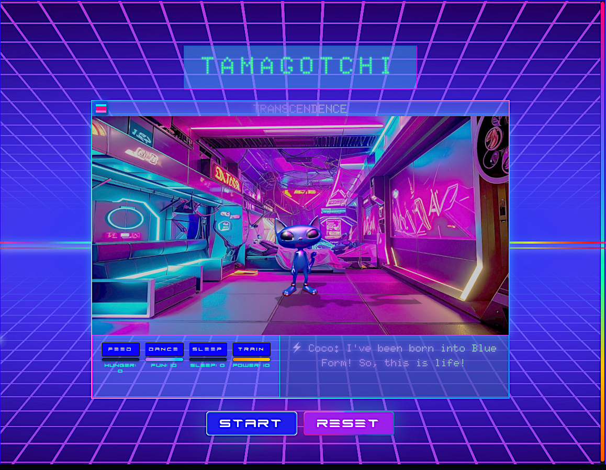

### Yellow Form

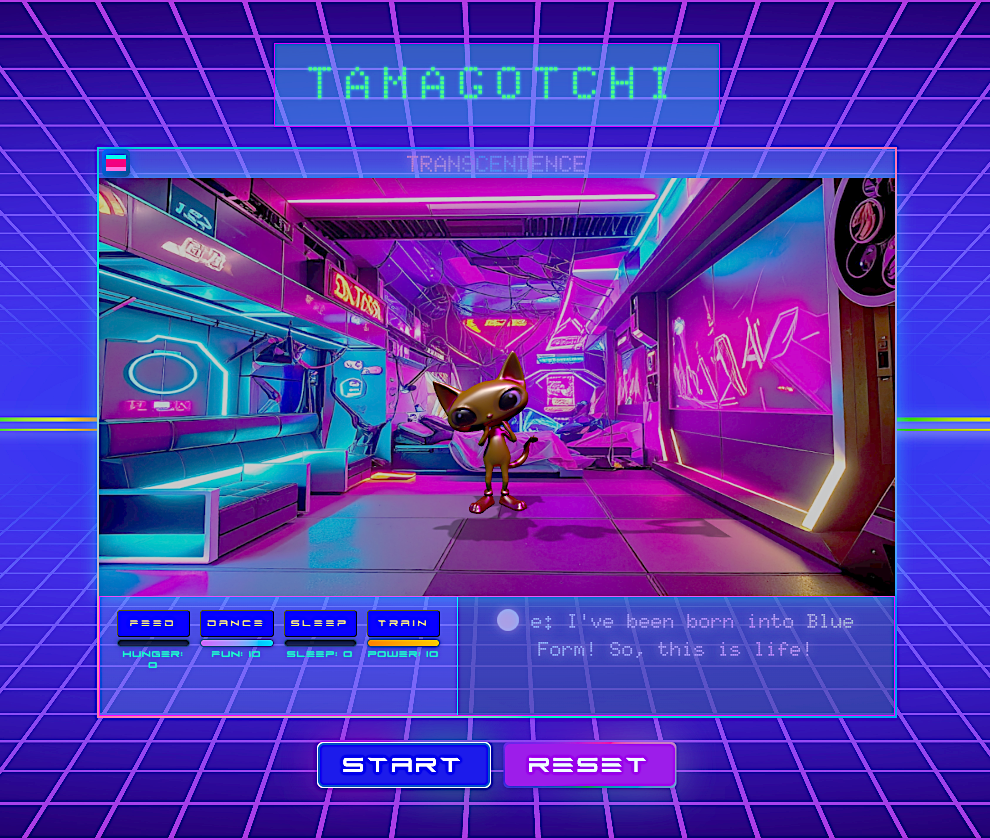

### Green Form

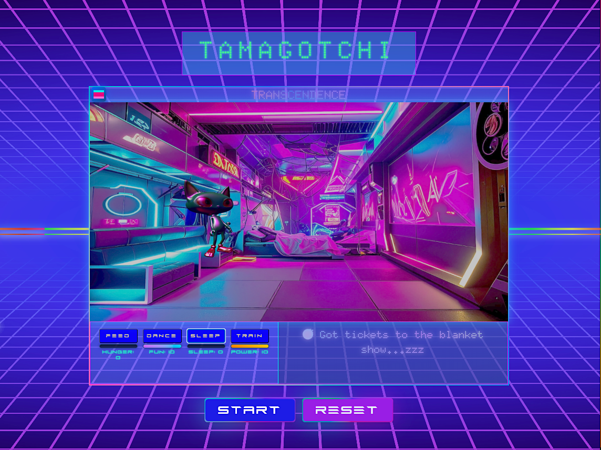

### Red Form

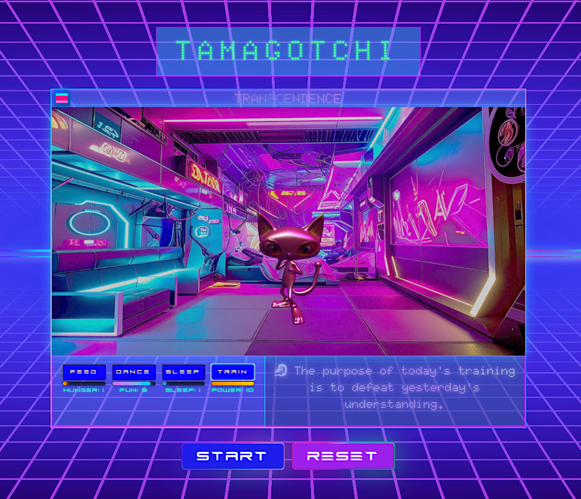

### Translucent White (Transcendence)

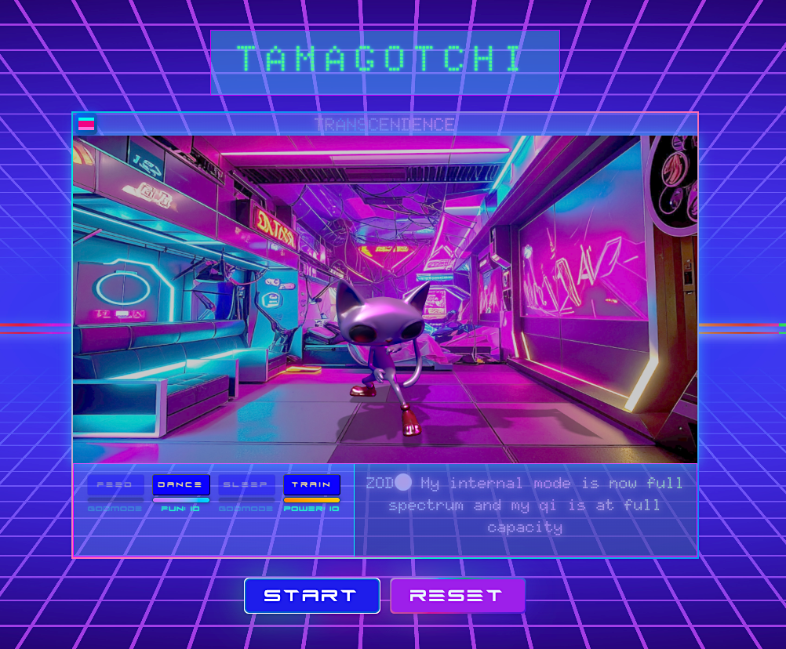

### Gameplay Interface


### Additional Screenshots

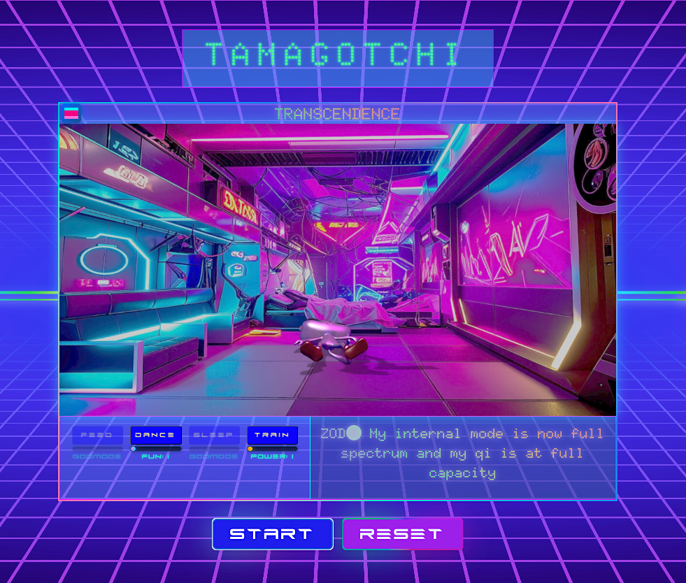
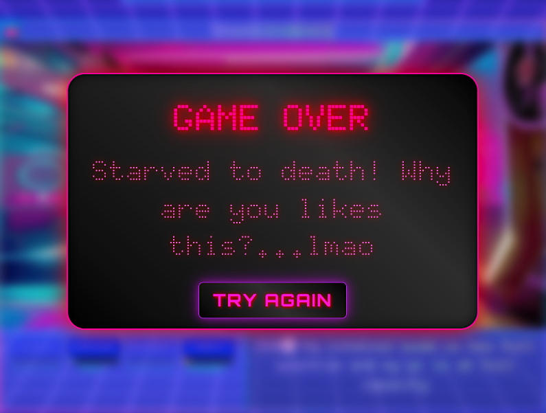
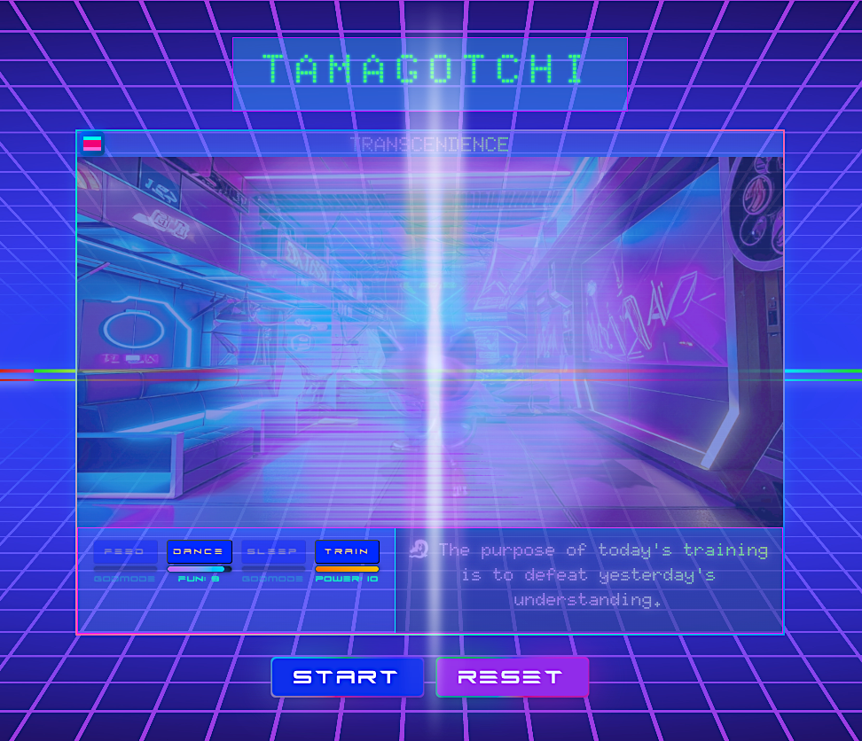
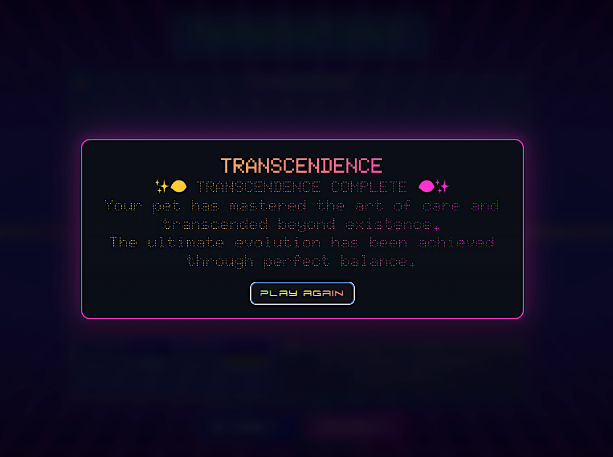


## 🙌 Credits

- **Design / Code / Characters**: Pablo Cordero
- **Contact**: cordero080@gmail.com
- Inspired by Tamagotchi + spectrum-of-light/energy ideas

## 🔭 Next Ideas / TODO

### 🔥 In Progress

- [ ] **Final evolution stutter fix** — smooth transition when reaching Translucent White
- [ ] **Glitch stutter between evolutions** — add visual glitch effect during stage transitions

### 🌟 Future Features

- [ ] Alternate evolution branch (Pink/Purple variants)
- [ ] Device "battery" meta stat tied to Power
- [ ] Soft achievements (e.g., Perfect Discipline chain)
- [x] ~~Easter egg: alternate game after user wins the game~~ ✅ **"upside!" button → Battle Arena**
- [ ] Mobile touch controls
- [ ] Save/load game state to localStorage

### 🚀 Stretch Goals

- [x] ~~**Level 2: Battle Mode**~~ ✅ **Battle Arena with 3 scenes (React Three Fiber)**
  - Dance Battle scene with metallic chrome cats
  - Cyberpunk Fighting Arena scene
  - Japanese Training Dojo with cherry blossoms & lanterns

## 🎯 Game Rules Deep Dive

### Evolution Requirements

To evolve to the next stage, you must complete **one full care cycle**:

1. ✅ Feed your pet
2. ✅ Make it Dance (x2 different dances)
3. ✅ Let it Sleep
4. ✅ Train it (x2 different training moves)

Once all actions are performed, your pet **evolves** to the next color stage!

### Stat Decay

- Stats decrease automatically over time (every 12 seconds)
- If **any stat reaches 0**, your pet **dies** 💀
- Keep all stats balanced to survive!

### Special Rules by Stage

| Stage | Color     | Special Rules                                     |
| ----- | --------- | ------------------------------------------------- |
| 1     | 🔵 Blue   | Standard care cycle                               |
| 2     | 🟡 Yellow | Standard care cycle                               |
| 3     | 🟢 Green  | Standard care cycle                               |
| 4     | 🔴 Red    | Standard care cycle                               |
| 5     | ⚪ White  | **Training ONLY** — Transcendent meditation state |

### Death & Game Over

- When any stat hits 0, your pet plays a death animation
- The pet freezes in its final pose
- A glitchy "GAME OVER" overlay appears
- Press **Reset** to start a new game

### Victory Condition

Reach **Translucent White** stage and maintain your pet through continuous training. You've achieved transcendence! 🌟

## 📄 License

MIT License - feel free to use this code for learning purposes.
